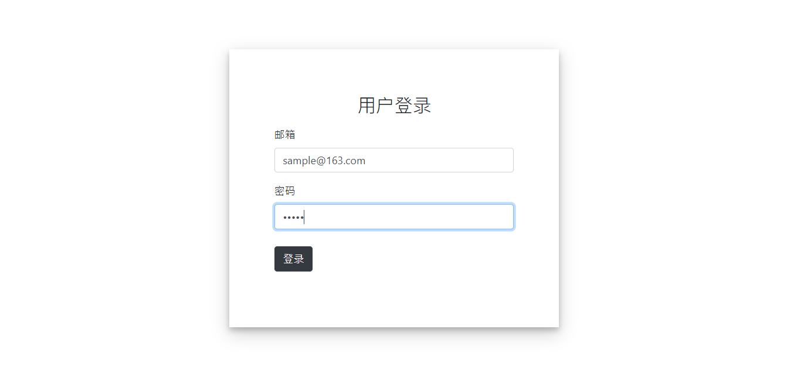
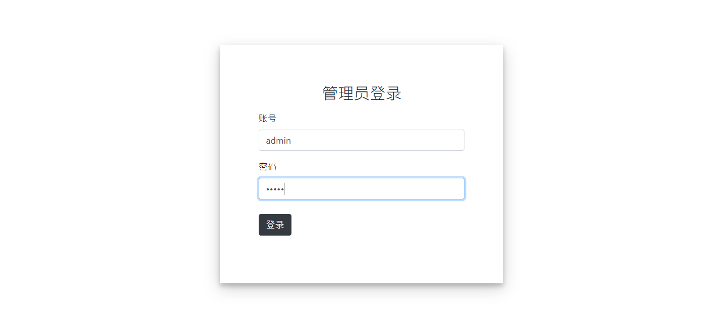
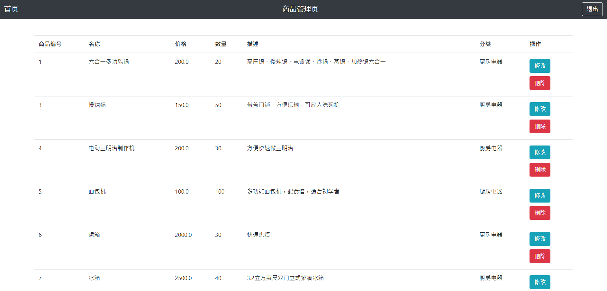

# Online Shop Application
My software engineering homework.

## Overview
A simple web application for online shopping using Spring Boot. 
It has both the foreground for customers and background for administrator.

## Requirements
- Docker
- Docker Compose

## Get Started
1.clone the repo
```shell script
$ git clone https://github.com/LemniscateX/se-project.git
```

2.cd in the repo
```shell script
$ cd se-project
```

3.run
```shell script
$ docker-compose up -d
```

4.open http://localhost:8080

## Documents
- [Interface](documents/interface.md)
- [Manual](documents/manual.md)

## Screenshots
#### For customers
Login page:

Shopping page:


#### For administrator
Login page:

Product Managing page:


See more in [manual](documents/manual.md).
