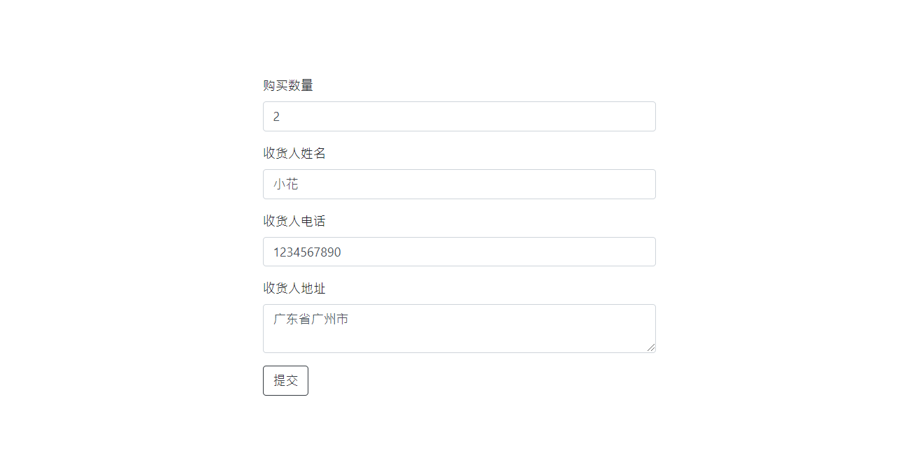

# 软件使用说明书

### 1. 引言

#### 1.1 编写目的

本文档通过描述各功能模块的具体操作，为系统用户提供操作说明等帮助信息。

通过本文档，使所有系统用户了解本系统，并学会如何操作使用本系统。

#### 1.2 项目背景

随着信息技术和互联网的飞速发展，网络技术逐渐渗透到经济和社会的方方面面，影响和便利着人们的日常生活。在商品销售行业，新兴的互联网技术让销售企业不再局限于实体运营的传统方式，转而开发线上销售渠道，通过一张无形的网构建出便利快捷的商品销售模式，为人们生活提供了极大的便利。

基于以上事实，开发一套方便快捷、高效实用且安全稳定的家电销售订单管理系统成为了家电企业的当务之急。订单管理系统能够有效融合好已有的大量的客户资料信息、商品信息、订单信息、销售数据以及分析数据，并以此为基础发展出一站式供应链服务，即订单情况的记录、跟踪、控制和反馈，满足人们对商品购买的快捷、便利的需求。

#### 1.3 参考资料

家电销售系统需求规格说明书

### 2. 软件概述

#### 2.1 目标

- 保证系统全天候安全且高效的运行
- 客户能够使用家电商品的浏览和购买功能
- 业务人员能够完成订单的监控和管理工作
- 业务人员能够查看各类数据统计并进行分析

#### 2.2 功能

本系统用于家电销售订单的管理，客户端用户可以通过此系统浏览商品、提交订单、追踪订单，服务端用户可以通过此系统管理商品、管理订单、分析数据。

#### 2.3 性能

- 数据精确度高
- 响应时间较快

### 3. 运行环境

#### 3.1 硬件

无硬件要求

#### 3.2 支持软件

浏览器

### 4. 使用说明

#### 4.1 用户操作

- 注册/登录/退出

系统用户在浏览器中输入网址进入系统，初始页面包含注册和登录按钮，用户可点击按钮进行对应的操作。

消费者初次进入系统时需先进行注册，提交信息包括作为账号的邮箱和自定义密码。点击注册后会自动跳转至系统主页。

已有账户的用户可在进入系统后点击登录按钮进行登录，输入注册时填写的账号和密码即可。若账号密码正确则跳转至系统主页，否则提示账号和密码的错误信息。

登录后进入主页进行功能选择，包括浏览商品和查看订单两个按钮，点击即可跳转至相应页面。用户也可以通过点击右上角的退出按钮来退出账号，页面将跳转至系统初始页。

- 浏览商品/提交订单

用户通过点击系统主页的浏览商品按钮进入商品浏览页面，用户可以在此页面进行商品的分类浏览和购买。

对于需要购买的商品，用户可以点击商品左下角的购买按钮，进入订单填写页面，订单的填写内容包括购买数量、收货人姓名、收货人电话和收货人地址。

填写完毕后可点击提交按钮进行订单的提交，若成功提交则会自动跳转至提交成功消息页面。

- 查看订单

用户可以点击系统主页的我的订单按钮进行订单查看，显示内容包括订单编号、商品名称、商品价格、商品数量、订单金额、订单状态、收件人姓名、收件人电话、收件人地址和操作。针对不同的订单状态，操作栏显示不同信息，包含待发货、待收货和已完成，其中待收货的情况下操作栏将产生一个收货按钮，点击按钮即可确认收货。

#### 4.2 管理员操作

- 登录

系统管理员在浏览器中输入系统网址并加上(/admin)进入管理员登录页面。若账号密码正确则跳转至系统管理员主页，否则提示账号和密码的错误信息。

登录后进入管理员主页进行功能选择，包括管理商品、管理订单、管理用户三个按钮，点击即可跳转至相应页面。管理员也可以通过点击右上角的退出按钮来退出账号，页面将跳转至系统管理初始页。

- 商品管理

管理员通过点击系统主页的管理商品按钮进入商品管理页面，管理员可以在此页面进行商品的添加、删除和修改。

管理员可以点击商品列右方的修改和删除按钮进行商品的删除和修改。

在商品列表下方填写表单即可进行商品的添加。

- 订单管理

管理员通过点击系统主页的管理订单按钮进入订单管理页面，管理员可以在此页面查看所有用户的所有订单。对于未发货的订单，管理员可以点击其右方的发货按钮进行发货。

- 用户管理

管理员通过点击系统主页的管理用户按钮进入用户管理页面，管理员可以在此页面查看所有用户的账号信息。具体包括用户的注册邮箱和密码。

